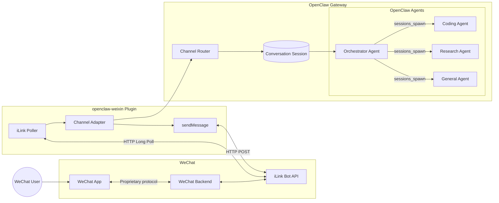

# OpenClaw Multi-Agent Architecture for Desktop + WeChat

## Quick Start

### Deploy on This Machine

```bash
cd ~/github/openclaw-multi-agent

# 1. Copy workspace files and create agent directories
./openclaw/setup.sh --apply

# 2. Automatically merge the multi-agent config into your existing openclaw.json
./openclaw/merge-config.sh --apply
# (runs dry-run first: ./openclaw/merge-config.sh)

# 3. Restart the gateway
openclaw gateway restart

# 4. Verify
openclaw agents list --bindings
openclaw channels status --probe
```

Or see what would change:

```bash
./openclaw/generate-config.sh --diff
```

### Deploy on Another Desktop

```bash
git clone <repo-url>
cd openclaw-multi-agent
./openclaw/setup.sh --apply
./openclaw/merge-config.sh --apply

# Then restart the gateway
openclaw gateway restart
```

### Recommended: Version-Track Your Config

```bash
cd ~/.openclaw
git init
cp ~/github/openclaw-multi-agent/openclaw/.gitignore .
git add -A
git commit -m "Initial OpenClaw config snapshot"
```

This lets you review, rollback, and sync config changes across machines. Session data and credentials are excluded via `.gitignore`.

---

## Key Design Decisions in This Implementation

### Orchestrator Uses `sessions_send` (Not `sessions_spawn`)

The orchestrator (**Nexus**) delegates tasks to specialist agents by sending messages to their persistent sessions via **`sessions_send`**, rather than spawning ephemeral sub-agents.

**Why:** Each specialist maintains its own conversation history. A coding conversation stays in the coding agent's context; a research thread stays in research's. The orchestrator stays lean — just a router with intent classification.

**Trade-off:** Specialists have persistent context windows that grow over time. If a specialist's context becomes bloated, the orchestrator can spawn a fresh sub-agent instead.

### Routing Model: Inbound Message → Orchestrator → Specialist

All WeChat messages enter through the orchestrator first. It classifies intent, selects a specialist, and forwards via `sessions_send`. The specialist responds, and the orchestrator relays the reply as-is.

### Each Agent Has a Full Identity

Each workspace contains:
- `AGENTS.md` — operational instructions
- `SOUL.md` — personality, tone, values
- `USER.md` — shared user context
- `TOOLS.md` — environment-specific notes
- `IDENTITY.md` — name, emoji, vibe

### Agents Are in `agents.list`, Not External Services

All agents run inside OpenClaw as first-class `agents.list` entries. No external routing service, no Python glue. Agent-to-agent messaging is enabled via `tools.agentToAgent`.

### These Decisions Are Subject to Change

This is an evolving implementation. If you iterate on new approaches later — switching to `sessions_spawn`, adding an external orchestrator, changing the routing model — the **Coding Agent** (`workspaces/coding/`) should recognize that this section needs updating and edit it accordingly.

---

## Testing

### Prerequisites

Before running the test, the multi-agent setup must be deployed:

```bash
# 1. Copy workspace files to ~/.openclaw
./openclaw/setup.sh --apply

# 2. Auto-merge multi-agent config into ~/.openclaw/openclaw.json
./openclaw/merge-config.sh --apply

# 3. Restart gateway
openclaw gateway restart

# 4. Confirm agents loaded
openclaw agents list --bindings
# Expected: orchestrator, coding, research, general
```

If any agent is missing, the test will fail because `openclaw agent --agent <id>` won't find it.

### Quick Smoke Test

```bash
cd ~/github/openclaw-multi-agent
./openclaw/test.sh
```

Full test suite:

```bash
./openclaw/test.sh --all
```

### What the Test Does (Under the Hood)

The script exercises the multi-agent setup without touching your live WeChat channel. It uses the Gateway CLI directly, bypassing any channel routing.

**Checks in order:**

1. **Gateway reachable** — confirms `openclaw status` returns successfully before attempting anything else.

2. **All 4 agents registered** — reads `openclaw agents list --bindings` and verifies `orchestrator`, `coding`, `research`, and `general` all appear.

3. **Each agent responds** — sends an identity probe to each agent via:
   ```bash
   openclaw agent --agent <id> --message "Who are you?" --timeout 30
   ```
   This confirms:
   - The agent loads its workspace files (AGENTS.md, SOUL.md, etc.)
   - Its model provider is configured and responding
   - It returns a non-error response reflecting the correct persona

4. **Persona differentiation** — compares responses from coding, research, and general to verify each agent speaks with its own voice (Nexus 🔀, Coder 💻, Scholar 🔍, Atlas 🌐).

5. **Orchestrator routing** (only with `--routing` or `--all`) — sends a coding request and a general request to the orchestrator agent. This tests:
   - Intent classification (does it recognize "write a Python function" as coding?)
   - `sessions_send` delegation (does it forward to the coding agent?)
   - Response relay (does the coding agent's reply come back through the orchestrator?)

### Interpreting Results

| Check | What a Pass Means | What a Fail Might Mean |
|---|---|---|
| Gateway reachable | Gateway is running | `openclaw gateway start` needed |
| Agent registered | Agent is in `agents.list` | Config not merged yet, or gateway needs restart |
| Agent responds | Agent loads workspace, model works | Missing API key, wrong model config, workspace path wrong |
| Persona differentiation | Each agent has a distinct identity | Shared workspace files, or model doesn't follow persona prompts |
| Orchestrator routing | `sessions_send` + intent classification works | `tools.agentToAgent` not enabled, or AGENTS.md routing rules need tuning |

### Test Options

| Flag | What It Tests | When to Use |
|---|---|---|
| *(none)* | Basic health + agent responsiveness | Deploy verification, quick sanity check |
| `--verbose` | Same as default + full response text | Debugging persona issues |
| `--routing` | Basic checks + orchestrator delegation | After confirming base agents work |
| `--all` | Everything | Full regression test after config changes |

### Test File

The test script lives at `openclaw/test.sh` in this repo. When you deploy to another desktop, the test travels with the repo — run it immediately after setup to confirm everything works.

---

## Overview

This project describes a multi-agent architecture built on top of OpenClaw.

The goal is to create a desktop AI assistant that can:

* integrate with WeChat;
* maintain isolated user conversations;
* route requests to specialized AI agents;
* use multiple agents collaboratively for complex tasks;
* keep downstream LLM context windows small;
* allow agent behavior to evolve safely over time.

The architecture follows one key principle:

> OpenClaw remains the execution framework. The orchestrator is implemented as an OpenClaw agent, not as an external routing service.

---

# Design Goals

## 1. Specialist Agents Instead of One Monolithic Agent

A single general-purpose agent accumulates:

* large system prompts;
* many tools;
* unrelated domain knowledge;
* unnecessary memory.

Instead, the system uses multiple focused agents.

Example:

```text
                    User Request

                         |
                         v

                Orchestrator Agent

          +--------------+--------------+
          |              |              |
          v              v              v

       Coding        Research       General
        Agent          Agent         Agent
```

Each specialist receives only the context relevant to its task.

Benefits:

* smaller prompts;
* lower token usage;
* better reasoning quality;
* easier maintenance.

---

# 2. OpenClaw Owns Execution

The system intentionally keeps the following responsibilities inside OpenClaw:

* Gateway
* channel handling
* session management
* agent lifecycle
* tool execution
* memory handling
* delivery of responses

The orchestrator does not bypass OpenClaw.

---

# 3. Orchestration Is an Agent Capability

The orchestrator is itself a normal OpenClaw agent.

It has:

* its own workspace;
* its own instructions;
* its own memory;
* its own model configuration.

Its job is:

1. understand user intent;
2. determine required capabilities;
3. spawn specialist agents;
4. combine responses;
5. return the final answer.

---

# High-Level Architecture



---

# Request Flow

## Simple Request

Example:

> Explain Rust ownership.

Flow:

```text
WeChat User

    |
    v

OpenClaw Gateway

    |
    v

Orchestrator Agent

    |
    v

Coding Agent

    |
    v

Response
```

---

## Multi-Agent Request

Example:

> Research the latest MCP changes and write migration code.

Flow:

```text
User

 |

 v

Orchestrator Agent


       +----------------+

       |                |

       v                v


Research Agent     Coding Agent


       |                |

       +-------+--------+

               |

               v

        Final Response
```

The orchestrator decides when multiple specialists are required.

---

# OpenClaw Agent Model

An agent is an isolated execution environment.

Conceptually:

```text
Agent

 |
 +-- Workspace
 |
 +-- Instructions
 |
 +-- Skills
 |
 +-- Tools
 |
 +-- Memory
 |
 +-- Model Configuration
```

Example:

```yaml
id: coding

workspace: ~/.openclaw/workspaces/coding

model:
  provider: openai
  name: gpt-5

tools:

  - terminal

  - filesystem

  - github

capabilities:

  - programming

  - debugging

  - architecture
```

---

# Recommended Agent Layout

```text
~/.openclaw/

    openclaw.json


    agents/

        orchestrator/

        coding/

        research/

        general/


    workspaces/

        orchestrator/

        coding/

        research/

        general/
```

---

# Agent Configuration

Example:

```yaml
agents:

  list:

    - id: orchestrator

      workspace: ~/.openclaw/workspaces/orchestrator


    - id: coding

      workspace: ~/.openclaw/workspaces/coding


    - id: research

      workspace: ~/.openclaw/workspaces/research


    - id: general

      workspace: ~/.openclaw/workspaces/general


bindings:

  - agentId: orchestrator

    match:

      channel: openclaw-weixin

      accountId: "*"
```

The important design decision:

> All inbound WeChat messages enter through the orchestrator first.

---

# Orchestrator Design

The orchestrator should remain lightweight.

It should not solve problems itself.

Its responsibilities:

* classify intent;
* select specialists;
* delegate work;
* merge results.

Example `AGENTS.md`:

```markdown
You are the orchestration agent.

Your job:

1. Understand the user's request.
2. Determine required capabilities.
3. Spawn specialist agents when needed.
4. Combine responses.

Available specialists:

Coding Agent:
- programming
- debugging
- software architecture

Research Agent:
- web research
- factual questions
- citations

General Agent:
- casual conversation
- miscellaneous questions
```

---

# Specialist Agent Design

## Coding Agent

Workspace:

```text
workspaces/coding/

    SOUL.md

    AGENTS.md

    skills/

    MEMORY.md
```

Example instructions:

```markdown
You are a senior software engineer.

Prioritize:

- correctness;
- maintainability;
- explaining tradeoffs.

Use tools when appropriate.
```

---

## Research Agent

Workspace:

```text
workspaces/research/

    SOUL.md

    AGENTS.md

    skills/

    MEMORY.md
```

Example instructions:

```markdown
You are a research analyst.

Prioritize:

- reliable sources;
- evidence;
- citations;
- concise summaries.
```

---

# User Isolation

OpenClaw maintains conversation isolation through its session model.

The diagram should be understood as:

```text
Channel Identity

        |

        v

OpenClaw Session

        |

        v

Agent Context
```

Multiple users can be supported when the channel integration exposes distinct identities.

Examples:

* multiple WeChat accounts;
* different peers;
* multiple channels.

The architecture does not assume that one WeChat account automatically creates multiple isolated users.

---

# Agent Evolution

Agents should evolve through workspace management.

The stable entity is the agent identity.

The changing entity is:

* instructions;
* skills;
* tools;
* prompts;
* memories.

Example:

```text
coding/

    releases/

        2026-07-01/

        2026-07-09/


    current
```

Current version:

```text
current -> releases/2026-07-09
```

Rollback:

```text
current -> releases/2026-07-01
```

---

# Recommended Version Control

Use git for workspace evolution.

Example:

```text
workspace-coding/

    .git/

    SOUL.md

    AGENTS.md

    skills/
```

Benefits:

* review changes;
* compare prompts;
* rollback behavior;
* experiment safely.

---

# Adding a New Specialist

Example: add Finance Agent.

Steps:

## 1. Create workspace

```text
workspaces/finance/
```

---

## 2. Add instructions

```text
SOUL.md

AGENTS.md

skills/
```

---

## 3. Register agent

```yaml
agents:

  - id: finance

    workspace:

      ~/.openclaw/workspaces/finance
```

---

## 4. Update orchestrator knowledge

Add:

```markdown
Finance Agent:

Use for:

- investment analysis;
- accounting;
- financial modeling.
```

---

# Monitoring and Usage

OpenClaw session history provides conversation persistence.

For operational monitoring, add telemetry around agent execution.

Recommended event:

```yaml
timestamp:

session:

user:

agent:

model:

input_tokens:

output_tokens:

latency_ms:

cost_usd:

status:
```

Example:

```json
{
  "session": "abc123",
  "agent": "coding",
  "model": "gpt-5",
  "input_tokens": 2200,
  "output_tokens": 800,
  "latency_ms": 3500
}
```

---

# Reports

Useful metrics:

## Agent Usage

```text
Coding Agent

Requests:
    12000

Tokens:
    18M

Cost:
    $240
```

---

## Routing Distribution

```text
Requests:

Coding:
    60%

Research:
    25%

General:
    15%
```

---

## Multi-Agent Usage

```text
Single Agent:
    90%

Multiple Agents:
    10%
```

---

# Implementation Roadmap

## Phase 1 — Native OpenClaw Multi-Agent

Implement:

* orchestrator agent;
* coding agent;
* research agent;
* general agent.

Use only OpenClaw configuration.

---

## Phase 2 — Better Routing

Improve:

* intent classification;
* specialist selection;
* delegation prompts;
* response synthesis.

---

## Phase 3 — Operations

Add:

* telemetry;
* dashboards;
* cost optimization;
* workspace deployment automation.

---

# Final Architecture Summary

```text
                  WeChat

                     |

                     v

            OpenClaw Gateway

                     |

                     v

          Orchestrator Agent

             /      |       \

            /       |        \

           v        v         v

       Coding   Research   General

        Agent     Agent      Agent
```

The core design principle:

> Use OpenClaw agents as the execution units. Use the orchestrator agent as the decision-maker. Keep infrastructure simple until scale requires additional layers.
